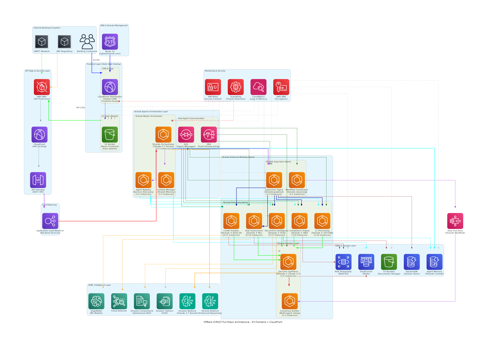

# 🏗️ VPBank K-MULT Agent Studio - Architecture Diagrams

## 📐 **Current Architecture Diagrams (Latest)**

### **🎯 Core Architecture Diagrams**

#### **1. 🌐 Full-Stack Architecture with S3 Frontend**

📐 [Edit in Draw.io](./vpbank-kmult-fullstack-architecture.drawio)

**Description**: Complete full-stack system architecture showing:
- **Frontend**: S3 static website hosting + CloudFront CDN
- **Backend**: Strands-enhanced multi-agent platform on ECS Fargate
- **Integration**: API Gateway, Route 53 DNS, complete data flow
- **Security**: WAF, banking-grade security layers

**Use Cases**:
- Executive presentations
- Technical implementation planning
- Full-stack development reference
- Production deployment guide

---

#### **2. 🚀 Strands-Enhanced Multi-Agent Architecture**

📐 [Edit in Draw.io](./vpbank-kmult-strands-enhanced-architecture.drawio)

**Description**: Advanced multi-agent system with Strands orchestration:
- **Strands Orchestration Layer**: Master coordination with Claude-3.5 Sonnet
- **7 Banking Agents**: Enhanced with Strands capabilities
- **Consensus Building**: Multi-agent voting and decision validation
- **Context Sharing**: Real-time shared intelligence across agents

**Use Cases**:
- AI/ML team technical reference
- Agent development and coordination
- Strands integration planning
- Multi-agent workflow optimization

---

#### **3. 🏗️ High-Level AWS ECS Fargate Architecture**

📐 [Edit in Draw.io](./vpbank-kmult-high-level-architecture.drawio)

**Description**: Clean overview of AWS infrastructure:
- **ECS Fargate Platform**: Container orchestration
- **AI/ML Services**: Bedrock, Textract, Comprehend, SageMaker
- **Data Layer**: RDS, DynamoDB, S3, ElastiCache
- **Monitoring**: CloudWatch, GuardDuty, security services

**Use Cases**:
- Infrastructure planning
- AWS service selection
- Cost estimation
- DevOps implementation

---

## 🎯 **Architecture Selection Guide**

| Use Case | Recommended Diagram | Purpose |
|----------|-------------------|---------|
| **Executive Presentation** | Full-Stack Architecture | Complete business solution overview |
| **Technical Deep Dive** | Strands-Enhanced Architecture | AI/ML and agent implementation details |
| **Infrastructure Planning** | High-Level AWS Architecture | AWS services and infrastructure setup |
| **Development Team** | All Three Diagrams | Complete technical reference |
| **Stakeholder Review** | Full-Stack Architecture | Business value and complete solution |

## 📊 **Architecture Comparison**

| Feature | Full-Stack | Strands-Enhanced | High-Level AWS |
|---------|------------|------------------|----------------|
| **Frontend Details** | ✅ Complete | ❌ Minimal | ❌ Not shown |
| **Agent Details** | ⚠️ Overview | ✅ Detailed | ⚠️ Overview |
| **AWS Services** | ⚠️ Key services | ⚠️ AI/ML focus | ✅ Complete |
| **Data Flow** | ✅ End-to-end | ⚠️ Agent-focused | ⚠️ Infrastructure |
| **Strands Integration** | ⚠️ Mentioned | ✅ Detailed | ❌ Not shown |

## 🔧 **How to Use These Diagrams**

### **📐 Editing Diagrams**
1. **Open Draw.io**: Go to https://app.diagrams.net
2. **Import File**: File → Import → Select .drawio file
3. **Edit**: Modify components, connections, labels
4. **Export**: File → Export as → Choose format (PNG, PDF, SVG)

### **📋 Presentation Tips**
- **Start with Full-Stack**: Show complete solution
- **Deep dive with Strands**: Explain AI/ML capabilities
- **Technical details with AWS**: Infrastructure implementation

### **🎯 Customization**
- **Colors**: Modify for brand consistency
- **Labels**: Update for specific use cases
- **Components**: Add/remove based on scope
- **Connections**: Adjust data flow as needed

## 📁 **File Organization**

```
docs/architecture/
├── 📋 README.md (this file)
├── 🖼️ vpbank-kmult-fullstack-architecture.png
├── 📐 vpbank-kmult-fullstack-architecture.drawio
├── 🖼️ vpbank-kmult-strands-enhanced-architecture.png
├── 📐 vpbank-kmult-strands-enhanced-architecture.drawio
├── 🖼️ vpbank-kmult-high-level-architecture.png
├── 📐 vpbank-kmult-high-level-architecture.drawio
└── 📂 legacy-architectures/ (archived old diagrams)
```

## 🚀 **Quick Export**

```bash
# Export all current diagrams
./scripts/export-diagrams.sh

# View architecture overview
cat docs/architecture/README.md
```

## 📈 **Architecture Evolution**

**Current Version**: v3.0 (January 2025)
- ✅ Strands Agents integration
- ✅ Full-stack S3 + CloudFront frontend
- ✅ Enhanced multi-agent orchestration
- ✅ Banking-grade security architecture

**Previous Versions**: Archived in `legacy-architectures/`
- v2.x: Basic multi-agent system
- v1.x: Single-agent architecture

## 🎯 **Next Steps**

1. **Review Current Diagrams**: Understand the latest architecture
2. **Select Appropriate Diagram**: Based on your use case
3. **Customize if Needed**: Edit .drawio files for specific requirements
4. **Present Solution**: Use diagrams for stakeholder communication

---

**📞 Support**: For architecture questions or customization needs, refer to the main project documentation or technical team.

**🔄 Updates**: These diagrams are maintained and updated with each major system enhancement.
